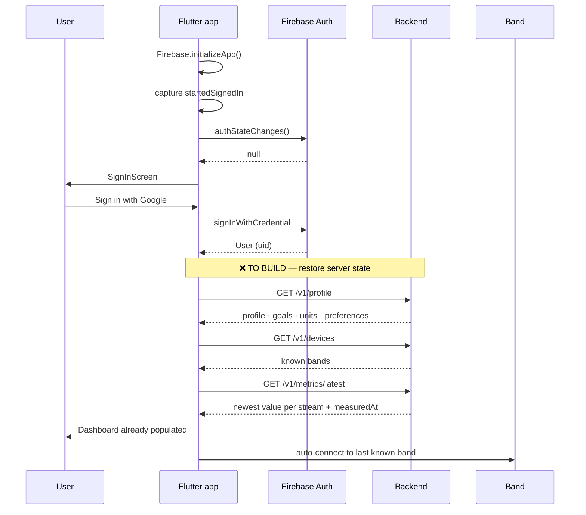
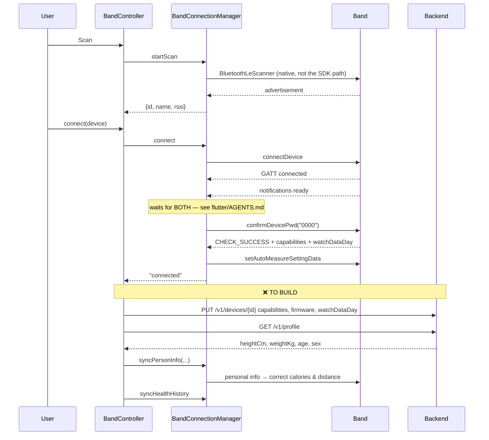
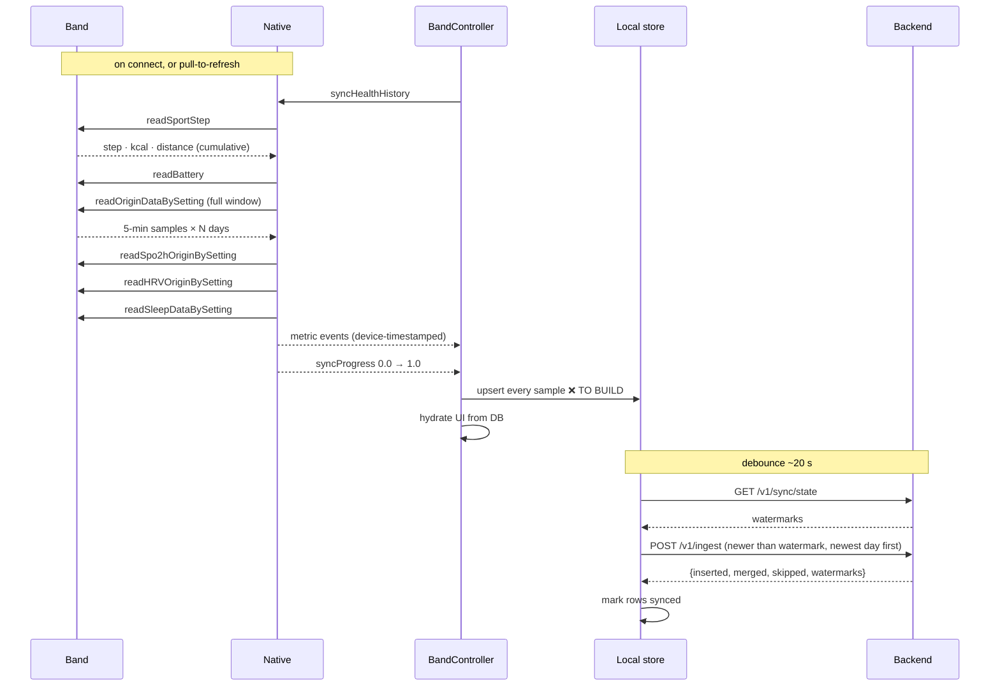
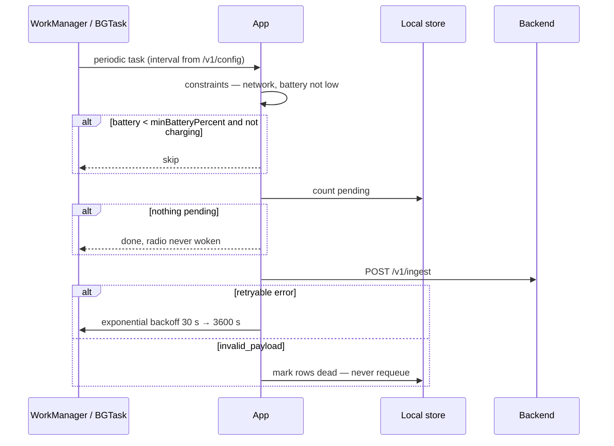
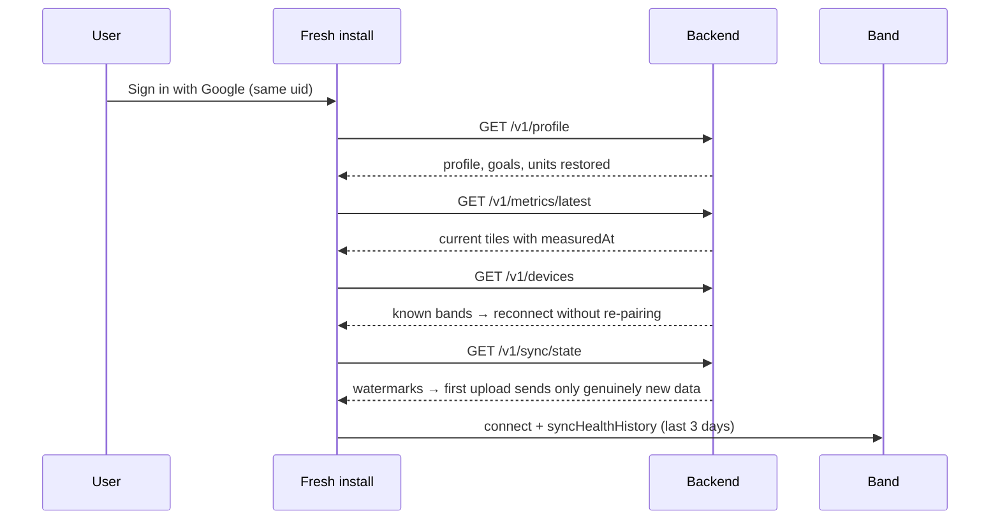
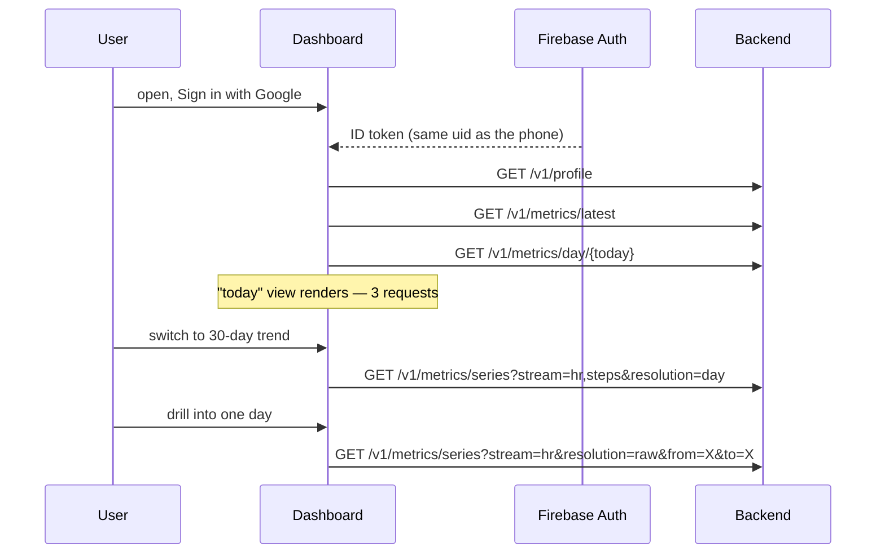

# Pulse Hypr — Data and App Flow

End-to-end: how a measurement travels from the band's sensor to a chart on a
screen, and which app flows drive it.

This is the **cross-repo orientation document**. It spans three codebases:

| | Path | State |
|---|---|---|
| Band SDK | [`Android_Ble_SDK/`](../Android_Ble_SDK) | Vendor (Veepoo/HBand), read-only |
| Mobile app | [`flutter/`](../flutter) | Built; missing persistence and sync |
| Backend | [`backend/`](../backend) | Built; not yet integrated |
| Web dashboard | *not started* | Planned |

Deeper detail lives in each repo:
[`backend/docs/`](../backend/docs/00-INDEX.md) ·
[`flutter/docs/findings.md`](../flutter/docs/findings.md) ·
[`flutter/docs/fixes/`](../flutter/docs/fixes/00-INDEX.md)

---

## 1. The system at a glance

```
┌─────────────────────────────────────────────────────────────────────────────┐
│  BAND — Veepoo KR96 PRO                                                     │
│                                                                             │
│  Optical sensor + accelerometer → onboard recording every ~5 min            │
│  Retains ~3 days  (FunctionDeviceSupportData.watchDataDay)                  │
│  Records with or without a phone present                                    │
└────────────────────────────────┬────────────────────────────────────────────┘
                                 │  BLE GATT · serialised · 6 stages
                                 │  triggered by connect / pull-to-refresh
┌────────────────────────────────▼────────────────────────────────────────────┐
│  ANDROID NATIVE — BandConnectionManager.kt                                  │
│                                                                             │
│  scan → connect → password handshake → capabilities → history sync          │
│  Converts SDK objects to primitive maps, stamps device time                 │
└────────────────────────────────┬────────────────────────────────────────────┘
                                 │  Platform channels
                                 │  com.pulsehypr.pulse_hypr/veepoo/*
┌────────────────────────────────▼────────────────────────────────────────────┐
│  DART — VeepooBandConnection → BandController                               │
│                                                                             │
│  Typed streams → in-memory "latest value" fields → widgets                  │
│  ⚠ every historical sample is discarded here today                          │
└────────────────────────────────┬────────────────────────────────────────────┘
                                 │  ❌ MISSING LINK
┌────────────────────────────────▼────────────────────────────────────────────┐
│  LOCAL SAMPLE STORE  (SQLite — to be built, flutter/docs/fixes/02)          │
│                                                                             │
│  The offline dashboard AND the upload queue. One table, two jobs.           │
└────────────────────────────────┬────────────────────────────────────────────┘
                                 │  ❌ MISSING LINK
                                 │  HTTPS + Firebase ID token · batched
┌────────────────────────────────▼────────────────────────────────────────────┐
│  BACKEND — Hono on Cloudflare Workers                                       │
│                                                                             │
│  verify token → validate → bucket into local days → merge → aggregate       │
└────────────────────────────────┬────────────────────────────────────────────┘
                                 │  Firestore REST (service account)
┌────────────────────────────────▼────────────────────────────────────────────┐
│  FIRESTORE — project hypr-8064c                                             │
│                                                                             │
│  raw 5-min blocks (90 d) · hourly frames (2 y) · daily frames (forever)     │
└────────────────────────────────┬────────────────────────────────────────────┘
                                 │  same REST API, same auth
        ┌────────────────────────┴────────────────────────┐
        ▼                                                 ▼
┌───────────────────────┐                     ┌───────────────────────────────┐
│  MOBILE (read back)   │                     │  WEB DASHBOARD  (not started) │
│  hydrate on reinstall │                     │  Google sign-in → same API    │
└───────────────────────┘                     └───────────────────────────────┘
```

**The single most important fact about this system:** the band holds ~3 days and
the app currently holds nothing across restarts. Until the two missing links are
built, every measurement older than the band's window is permanently lost.

---

## 2. Who owns what

| Data | Source of truth | Lives in | Notes |
|---|---|---|---|
| Raw measurements | Band sensor | Firestore (after sync) | Band memory is a 3-day buffer, not storage |
| Sample timestamps | Band's own clock | carried end to end | Wall-clock, no timezone attached |
| Timezone offset | Phone at capture time | attached per batch | Only zone information that exists anywhere |
| Body profile | User → backend | Firestore `users/{uid}` | Pushed *down* to the band via `syncPersonInfo` |
| Goals, units, prefs | User → backend | Firestore `users/{uid}` | Read by app and dashboard |
| Device identity | Platform (MAC / UUID) | Firestore `devices/{id}` | Differs per platform for one physical band |
| Band capabilities | Band handshake | Firestore `devices/{id}` | Verbatim from `DeviceFunctionPackage1..5` |
| Sync cursors | Backend | `devices/{id}.watermarks` | Per device, per stream |
| Sync policy | Backend | `GET /v1/config` | Cadence, battery floor, feature flags |
| Identity | Firebase Auth | Google sign-in | `uid` is the partition key for everything |

---

## 3. Data flow, hop by hop

Each hop below shows what moves, how the shape changes, and whether it exists.

### Hop 1 — Sensor → band memory

| | |
|---|---|
| **Trigger** | Band's own automatic-measurement schedule |
| **Cadence** | ~5 minutes |
| **Status** | ✅ Works. Configured by `setAutoMeasureSettingData` at pairing |

The band measures and stores on its own, phone or no phone. This is the correct
data strategy and the app already follows it: driving live detections from the
app produces no fresher data while keeping the optical sensor lit and draining
the band's battery ([`findings.md` §9](../flutter/docs/findings.md)).

The consequence for every downstream hop: **data is historical by nature**.
Nothing in this pipeline is real-time, and no part of it should pretend to be.

### Hop 2 — Band → Android native (BLE)

| | |
|---|---|
| **Trigger** | Connection established, or pull-to-refresh |
| **Code** | [`BandConnectionManager.syncHealthHistory()`](../flutter/android/app/src/main/kotlin/com/pulsehypr/pulse_hypr/BandConnectionManager.kt) |
| **Status** | ✅ Android. ⚠️ iOS has no history sync at all |

Six stages, strictly serialised — the band handles concurrent BLE operations
poorly — each with a 20-second watchdog that advances the queue if the SDK omits
its completion callback:

```
steps ──► battery ──► origin ──► SpO2 ──► HRV ──► sleep
 0.1       0.2        0.2–0.5   0.5–0.65 0.65–0.8  0.8–1.0     ← syncProgress
```

The `origin` stage is the substantial one. Protocol version selects the listener:

| `originProtocolVersion` | Listener | Carries |
|---|---|---|
| 3 or 5 | `IOriginData3Listener` | `ppgs`, `ecgs`, `oxygens`, `resRates`, `bloodGlucose`, `cardiacLoads`, `apneaResults`, `hypoxiaTimes`, `sleepStates`, `corrects`, `gesture`, plus all `OriginData` fields |
| other | `IOriginDataListener` | `rateValue`, `highValue`/`lowValue`, `temperature`, `stepValue`, `calValue`, `disValue` |

**Every history read requests the band's full retained window.** There are no
cursors, so the same samples are re-downloaded on every sync — which is why
idempotency matters so much further down the chain.

### Hop 3 — Native → Dart (platform channels)

| | |
|---|---|
| **Code** | [`VeepooBandConnection`](../flutter/lib/src/band/veepoo/veepoo_band_connection.dart) |
| **Status** | ✅ Implemented, and **lossy by design today** |

Prefix `com.pulsehypr.pulse_hypr/veepoo`, one `MethodChannel` for commands and
eleven `EventChannel`s for data:

```
/methods           startScan · connect · syncHealthHistory · startHeartRate · …
/scanResults       { id, name, rssi }
/connectionState   "connecting" | "authenticating" | "connected" | "reconnecting" | "disconnected"
/heartRate         { bpm, timestamp }
/oxygen            { percent, timestamp }
/hrv               { milliseconds, timestamp }
/bodyTemp          { celsius, timestamp }
/steps             { steps, calories, distanceKm, timestamp }
/bloodPressure     { systolic, diastolic, timestamp }
/sleep             { totalMinutes, deepMinutes, lightMinutes, remMinutes, timestamp }
/battery           { percent | level, charging, low, timestamp }
/syncProgress      { progress }
```

`timestamp` is epoch milliseconds derived from the **band's** clock via
`emitAt(…)`, not arrival time. That is what makes deduplication downstream
possible at all.

⚠️ **This hop discards most of what arrived.** `publishOrigin3` extracts one heart
rate from `ppgs` and drops `resRates`, `oxygens`, `bloodGlucose`, `cardiacLoads`,
`apneaResults`, `hypoxiaTimes`, `sleepStates`, `corrects` and `gesture`. The
backend already models all of them — forwarding is a bridge change with no
storage work.

### Hop 4 — Dart → local store ❌ **MISSING**

| | |
|---|---|
| **Spec** | [`flutter/docs/fixes/02-local-sample-persistence.md`](../flutter/docs/fixes/02-local-sample-persistence.md) |
| **Status** | ❌ Not built. **This is the blocking gap** |

Today [`BandController`](../flutter/lib/src/app/band_controller.dart) collapses
every stream into one nullable field per metric:

```dart
int? heartRateBpm;  DateTime? heartRateAt;
int? spo2Percent;   DateTime? spo2At;
// … 15 fields total, all cleared by _teardown()
```

A day's 288 heart-rate samples overwrite one integer 288 times. A force-stop
erases everything, and the next launch shows `--` placeholders until a fresh
six-stage BLE sync completes.

The store that replaces this is the same table the upload queue needs:

```sql
CREATE TABLE samples (
  device_id   TEXT    NOT NULL,
  stream      TEXT    NOT NULL,   -- backend registry id: 'hr', 'bp', 'spo2', …
  device_ts   INTEGER NOT NULL,   -- band clock, epoch ms
  value       REAL    NOT NULL,
  value1      REAL,               -- second channel (bp diastolic)
  quality     INTEGER NOT NULL DEFAULT 1,
  source      INTEGER NOT NULL,   -- 1 live · 2 auto · 3 poll · 4 manual · 5 platform
  tz_offset   INTEGER NOT NULL,   -- minutes east of UTC, at capture
  received_at INTEGER NOT NULL,
  synced_at   INTEGER,            -- NULL = pending upload
  PRIMARY KEY (device_id, stream, device_ts)
);
```

The primary key makes local writes idempotent, which matters because BLE history
reads overlap by design. `synced_at IS NULL` is the upload queue.

**Build it once, it serves both purposes.** Adding a separate sync queue later
would mean storing everything twice.

### Hop 5 — Local store → backend ❌ **MISSING**

| | |
|---|---|
| **Spec** | [`backend/docs/04-SYNC-PROTOCOL.md`](../backend/docs/04-SYNC-PROTOCOL.md) |
| **Status** | ❌ Client not built. Server side ready |

```
BLE sync settles
   → debounce ~20 s                          (one request per sync, not per callback)
   → GET  /v1/sync/state?deviceId=…          watermarks + limits
   → select local rows newer than watermark, newest day first
   → POST /v1/ingest                         columnar, ≤5,000 samples
   → mark rows synced, persist new watermarks
```

Unit conversions happen here — the API's canonical units differ from the SDK's:

| Dart | API | Conversion |
|---|---|---|
| `distanceKm` | `distance` in **metres** | × 1000 |
| `calories` kcal | `calories` kcal | none |
| `celsius` double | `temp` °C | none (backend scales ×100 internally) |
| `steps` bucket | `steps` stream | none |
| `steps` **cumulative** (`readSportStep`) | `counters.steps` | ⚠️ different field — see below |

⚠️ **The steps trap.** Two different things arrive under one name.
`OriginData.stepValue` is a five-minute bucket; `readSportStep().step` is the
running daily total. Sending the daily total as a `steps` sample gets it summed
into the bucket total and roughly doubles the day. Buckets go to `series`, totals
go to `counters`.

### Hop 6 — Backend → Firestore

| | |
|---|---|
| **Code** | [`backend/src/domain/ingest.ts`](../backend/src/domain/ingest.ts) |
| **Status** | ✅ Implemented and tested |

```
verify Firebase ID token           → uid
validate + clamp out-of-range      → CLAMPED quality bit, batch still succeeds
bucket by (local date, stream)     → tzOffsetMin decides the day and the slot
receipt check on batchId           → replay? return stored result, write nothing

per local day, chronologically:
   batchGet day doc + stream blocks         1 round-trip
   merge slots in memory                    source precedence, identical = no-op
   recompute daily + hourly aggregates
   commit blocks + day doc atomically       precondition on updateTime

then: sleep + events → month frames → device watermarks → receipt
```

Shape change at this hop is the largest in the system:

```
3,500 discrete readings/user/day   →   ~20 Firestore documents
{stream, t, v}  ×  N                →   288-slot packed binary frame per stream per day
```

Slot index is derived from the local timestamp, so writing is idempotent by
position — the same sample re-uploaded lands in the same slot with the same
value and produces no write at all.

### Hop 7 — Firestore → clients (read)

| | |
|---|---|
| **Code** | [`backend/src/routes/metrics.ts`](../backend/src/routes/metrics.ts) |
| **Status** | ✅ Implemented |

Resolution maps one-to-one onto a storage tier; a request never fans out across
tiers, so cost is predictable from its parameters:

| Request | Reads | Docs | Returns |
|---|---|---|---|
| `series?resolution=raw` | stream blocks | ≤31 × streams | 288 values/day + source + quality |
| `series?resolution=hour` | day docs | ≤92 | 24 buckets/day, `{n,min,max,value}` |
| `series?resolution=day` | month docs | ≤36 | one point/day |
| `day/:date` | one day doc | 1 | all streams summarised + counters + sleep |
| `latest` | recent day docs | ≤30 | newest value per stream + `measuredAt` |

Packed frames are decoded server-side; clients only ever see plain JSON.

### Hop 8 — Backend → web dashboard (upcoming)

| | |
|---|---|
| **Status** | ❌ Not started. Server side ready |

Same API, same Firebase ID token, same Google sign-in. No Firestore credential
reaches the browser and no client knows the storage layout — which is exactly
what makes the packed-frame design safe to change later.

---

## 4. App flows

### 4.1 First launch and sign-in



The order matters: local store first (instant, offline), server second to fill
gaps, band last. The user should never wait on the network to see a dashboard.

**Today** this flow ends at "User (uid)" — nothing is restored, so a returning
user sees empty tiles until BLE finishes.

⚠️ `BandController` is constructed in `MultiProvider` before auth resolves, so
band data can arrive while signed out. The sync engine must buffer to the local
store regardless of auth state and upload once a `uid` exists.

### 4.2 Pairing a band



⚠️ **`syncPersonInfo` is never called today.** Onboarding collects height, weight
and age ([`onboarding_screen.dart:25-27`](../flutter/lib/src/screens/onboarding_screen.dart#L25-L27))
and discards them, so the band computes calories and distance from defaults. The
backend profile closes this — it is the cheapest accuracy win available.

### 4.3 Routine sync — the main loop



Steps polling runs separately at 5 s (`STEPS_POLL_INTERVAL_MS`) for as long as
the band is connected — a cheap register read that never touches the optical
sensor. ⚠️ It is *not* lifecycle-aware today: the foreground service keeps the
process alive, so the loop continues at full cadence with the app backgrounded
and the screen off ([fix 13](../flutter/docs/fixes/13-lifecycle-aware-steps-polling.md)).

### 4.4 Background upload



The rule that matters: **never retry a non-retryable batch.** A poison batch
looping forever is the worst battery outcome this system can produce.

### 4.5 Offline

| Link down | Behaviour |
|---|---|
| Band ↔ phone | Band keeps recording. Phone shows last stored values with honest `measuredAt`. Sync catches up on reconnect, within the band's 3-day window |
| Phone ↔ backend | Samples queue in the local store. Dashboard fully functional — it reads local, not remote |
| Both | Dashboard still renders from the local store. This is the whole point of Hop 4 |

Nothing in the app should ever block on the network. Backend calls at startup are
wrapped so failure is non-fatal.

### 4.6 Reinstall or new phone



Without the backend this is impossible: the band holds three days and the app
holds nothing. **This flow is the clearest user-visible payoff of the whole
backend.**

### 4.7 Web dashboard load (upcoming)



The dashboard never writes measurements. Its only writes are profile, goals and
device nickname.

---

## 5. Cadence

| Activity | Interval | Driven by |
|---|---|---|
| Band records a sample | ~5 min | Band firmware |
| Steps register poll | 5 s | App, whenever connected — not lifecycle-aware yet |
| BLE history sync | on connect + pull-to-refresh | App |
| Upload after BLE sync | ~20 s debounce | `/v1/config` |
| Background upload | ~2 h | `/v1/config`, OS discretion |
| Manifest repair pass | daily + after failures | Client policy |
| Retention sweep | 03:20 UTC daily | Worker cron |
| ID token refresh | ~1 h | Firebase SDK |

Every client-side interval comes from `/v1/config`, so ingest load and phone
radio duty cycle can be retuned without an app-store release.

---

## 6. Timestamps and timezones

This is the most error-prone thread in the system, so it is worth tracing whole.

```
Band                  TimeData {year, month, day, hour, minute, second}
                      ⚠ wall clock, NO timezone
   │
   ▼  BandConnectionManager.deviceTimestamp()
Native                GregorianCalendar in the PHONE'S CURRENT ZONE → epoch ms
   │                  ⚠ the zone is applied here and then forgotten
   ▼  emitAt(metric, field, at)
Dart                  DateTime.fromMillisecondsSinceEpoch
   │
   ▼  local store
SQLite                device_ts + tz_offset          ← ✅ zone finally recorded
   │
   ▼  POST /v1/ingest {tzOffsetMin}
Backend               localMs = utcMs + tzOffsetMin × 60000
                      date = YYYY-MM-DD, slot = floor(msSinceMidnight / 300000)
   │
   ▼
Firestore             users/{uid}/days/{LOCAL date}/streams/{stream}
                      tzOffsetMin stored on the block
   │
   ▼  read
Client                startTs = midnight(date) − tzOffsetMin × 60000
                      sampleTs = startTs + slot × 300000     ← exact reconstruction
```

Three rules that fall out of this:

1. **`tzOffsetMin` is minutes *east* of UTC** — Dart's
   `DateTime.timeZoneOffset.inMinutes` convention (PKT = +300). This is the
   *opposite* sign to JavaScript's `getTimezoneOffset()`.
2. **Capture the offset at capture time, not upload time.** A user who flies
   between recording and syncing would otherwise have history silently shifted.
3. **Days are local, not UTC.** "Yesterday's steps" means the steps between the
   midnights the user actually lived through.

⚠️ Today the offset is applied at hop 2 and never recorded, so travel and DST
shift history invisibly. The local store is where that gets fixed.

DST is handled by keeping the frame at a fixed 288 slots: spring-forward leaves
an hour empty, fall-back maps the repeated hour onto written slots where the
merge policy resolves it. Up to 12 samples per year per DST-observing user
collapse to one — a documented trade, surfaced as `collisions` in the ingest
response.

---

## 7. Failure propagation

| Failure | Where it surfaces | Handling |
|---|---|---|
| Band out of range | `connectionState: reconnecting` | Band keeps recording; sync catches up |
| BLE stage timeout (20 s) | `failedStages` on the sync result | Queue advances; other stages still complete |
| Password handshake stuck | `CONNECTION_TIMEOUT_MS` watchdog | Surfaces as failure instead of hanging |
| Phone offline | Sync engine | Rows stay `synced_at IS NULL`; UI unaffected |
| ID token expired mid-backlog | `401 token_expired` | Refresh, **retry the same batch** — distinct code exists for this |
| Concurrent write to one day | `409 conflict` | Server retries 3×; client backs off |
| Firestore 429/5xx | `502 upstream_error` | 4 attempts with jittered backoff |
| One implausible sample | `rejected[]` or `clamped` bit | Batch still succeeds |
| Malformed batch | `422 invalid_payload` | Dead-letter it; never requeue |

Errors carry a stable `code` and a `retryable` boolean precisely so the client
branches on intent, not on HTTP status.

---

## 8. Where things stand

| Hop | Component | Status |
|---|---|---|
| 1 | Band auto-recording | ✅ Working (arming validated only on a GBand-touched band) |
| 2 | BLE history sync, Android | ✅ Working |
| 2 | BLE history sync, iOS | ❌ Absent — still runs the live-measurement anti-pattern |
| 3 | Platform channels | ✅ Working, ⚠️ drops most `OriginData3` fields |
| 3 | Auto-reconnect | ❌ `scheduleReconnect` is dead code (fix 01) |
| **4** | **Local sample store** | ❌ **Not built — blocks everything below** |
| **5** | **Sync engine** | ❌ **Not built** |
| 6 | Backend ingest | ✅ Built, typechecked, unit-tested; not yet exercised by a client |
| 6 | Firebase project consolidation | ❌ Two projects; iOS cannot authenticate |
| 7 | Read API | ✅ Built |
| 8 | Web dashboard | ❌ Not started |

### Suggested order

| # | Work | Unlocks |
|---|---|---|
| 1 | Local sample store (fix 02) | Offline dashboard; **prerequisite for 2** |
| 2 | Sync engine upload path | History survives reinstall |
| 3 | Profile round-trip + `syncPersonInfo` (fix 06) | Correct calories and distance on the band |
| 4 | Hydrate from `/metrics/latest` | Correct dashboard on a fresh install |
| 5 | Android auto-reconnect (fix 01) | Fewer sync gaps |
| 6 | Consolidate Firebase projects | iOS can sync at all |
| 7 | Forward dropped `OriginData3` fields | Respiratory rate, sleep stages, glucose — backend already accepts them |
| 8 | Web dashboard | Reads an API that already serves everything it needs |

Items 1, 3 and 5 are already on the app's own P0/P1 fix list. The backend does not
add work so much as give that work somewhere to land.

---

## 9. Reading further

| Question | Document |
|---|---|
| How do I set all of this up? | [`SETUP-AND-WIRING.md`](SETUP-AND-WIRING.md) |
| I'm a new collaborator, where do I start? | [`ONBOARDING.md`](ONBOARDING.md) |
| What should I build, in what order? | [`PHASES.md`](PHASES.md) |
| Why is the storage shaped like this? | [`backend/docs/05-DECISIONS.md`](../backend/docs/05-DECISIONS.md) |
| What exactly does an endpoint return? | [`backend/docs/03-API.md`](../backend/docs/03-API.md) |
| What does the client have to build? | [`backend/docs/06-FLUTTER-INTEGRATION.md`](../backend/docs/06-FLUTTER-INTEGRATION.md) |
| How do I deploy and operate it? | [`backend/docs/07-OPERATIONS.md`](../backend/docs/07-OPERATIONS.md) |
| Why does the band behave this way? | [`flutter/docs/findings.md`](../flutter/docs/findings.md) |
| What is broken in the app right now? | [`flutter/docs/fixes/00-INDEX.md`](../flutter/docs/fixes/00-INDEX.md) |
| Which BLE code must not be touched? | [`flutter/AGENTS.md`](../flutter/AGENTS.md) |
| How does the vendor SDK work? | [`flutter/docs/BLUETOOTH_SDK_BAND_CONNECTIVITY.md`](../flutter/docs/BLUETOOTH_SDK_BAND_CONNECTIVITY.md) |
